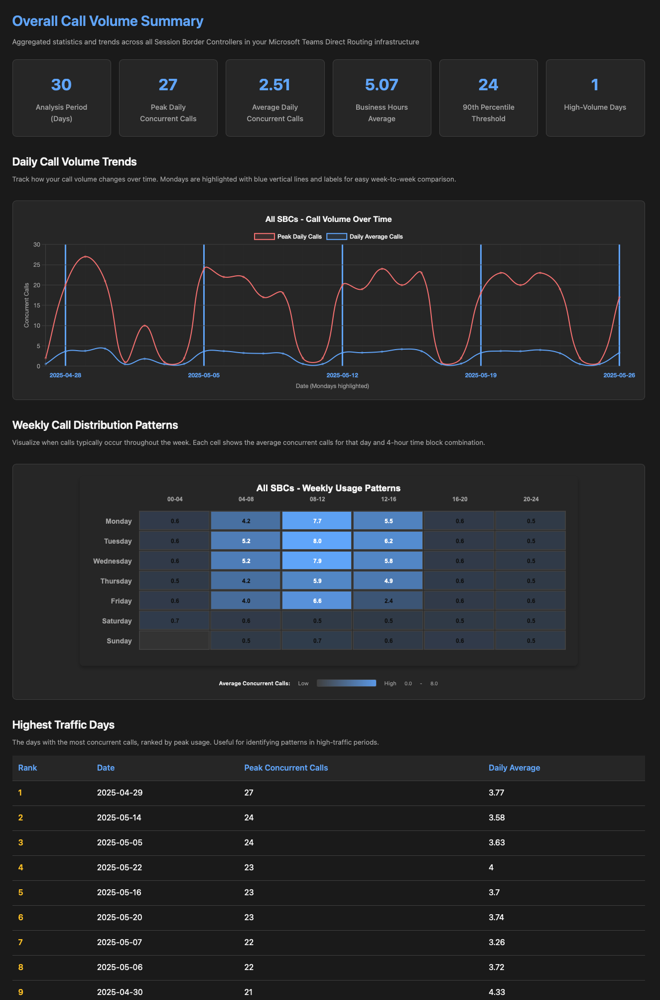

## The problem 
You've probably been asked this question before: **"How many concurrent calls are we handling through our Microsoft Teams Direct Routing SBCs?"**

Normally Teams admins head straight to the Teams Admin Center, check those usage reports for their SBCs, and find hourly incoming and outgoing call counts. While helpful, this doesn't answer the real question: **How many calls were happening simultaneously?**

This becomes even more challenging when you're running multiple SBCs with load balancing - you need to piece together the total concurrent call picture across your entire SIP trunk infrastructure.

## A PowerShell Solution
I needed better visibility into concurrent call patterns, so I built a PowerShell script that handles the calculations and data aggregation. The script includes an HTML dashboard (with some support from 🤖 Copilot for the visual elements) that provides:

- ✅ **Actual concurrent calls** calculations
- ✅ **Cross-SBC aggregation** for total infrastructure view
- ✅ **HTML dashboard** for reporting
- ✅ **Dual data sources**: Graph API or CSV exports
- ✅ **Business hours analysis** for capacity planning
- ✅ **Weekly usage patterns** and trend analysis


## GitHub Repository
You can find the script and detailed instructions in the GitHub repository: [Teams Direct Routing Concurrent Calls Analysis](https://github.com/t-nebel/dr-concurrent-calls-report)

## Sample Output

The generated HTML report will look like this:

<a href="screenshot_overview.png" target="_blank"></a>

## Key Features

**🔄 Flexible Data Sources - Two options depending on your workflow:**
- **Graph API**: Direct connection for automation with flexible date ranges
  - **App Secret** or **Certificate** authentication modes
- **CSV Import**: Works with Teams Admin Center exports for ad-hoc analysis

**📊 Easy Analytics**
- Daily concurrent call trends with visual charts
- Business hours averages (Monday-Friday, 8AM-6PM)
- 90th percentile capacity thresholds
- Weekly heatmaps showing peak usage times
- Top 10 highest traffic days for pattern analysis

## How to use this script

### Option 1: Graph API connection (flexible approach)

Best for flexible reporting for example in context of the date range.

#### Prerequisites
Cause the Graph permission for that is only usable in the application context (and not your user context), you need an **Azure App Registration** with GraphAPI application permission `CallRecords.Read.All`

#### Authentication Examples

**App Secret Authentication:**
```powershell
# Ensure you have the Microsoft.Graph module installed
$AppSecret = Read-Host "Enter App Secret" -AsSecureString
.\ConcurrentCallsAnalysis.ps1 -DataSource GraphAPI -GraphConnectionMode AppSecret -AppId "your-app-id" -TenantId "your-tenant-id" -AppSecret $AppSecret
```

**Certificate Authentication:**
```powershell
# Ensure you have the Microsoft.Graph module installed
.\ConcurrentCallsAnalysis.ps1 -DataSource GraphAPI -GraphConnectionMode Certificate -AppId "your-app-id" -TenantId "your-tenant-id" -CertificateThumbprint "cert-thumbprint"
```

#### Date Range Options
```powershell
# Last 30 days
.\ConcurrentCallsAnalysis.ps1 -DataSource GraphAPI -GraphConnectionMode AppSecret -AppId "..." -TenantId "..." -AppSecret $secret -startDate (Get-Date).AddDays(-30)

# Specific period
.\ConcurrentCallsAnalysis.ps1 -DataSource GraphAPI -GraphConnectionMode AppSecret -AppId "..." -TenantId "..." -AppSecret $secret -startDate "2024-01-01" -endDate "2024-01-31"
```

### Option 2: CSV Import (Quick Analysis)

Perfect for one-time analysis or when you prefer working with Teams Admin Center exports.

#### Step 1: Export from Teams Admin Center
1. Navigate to **Teams Admin Center** → **Analytics & reports** → **Usage reports**
2. Select **PSTN and SMS usage**
3. Choose **Direct Routing** tab
4. Set your date range and export to Excel
5. Save as CSV format

#### Step 2: Run the Analysis
```powershell
.\ConcurrentCallsAnalysis.ps1 -DataSource CSV -CsvPath "C:\Downloads\DirectRoutingData.csv"
```

### Additional Options
```powershell
# Specific SBCs only
.\ConcurrentCallsAnalysis.ps1 -DataSource CSV -CsvPath "data.csv" -sbcFQDNs @("sbc1.domain.com", "sbc2.domain.com")

# Custom output location
.\ConcurrentCallsAnalysis.ps1 -DataSource GraphAPI -GraphConnectionMode AppSecret ... -outputPath "C:\Reports\TeamsAnalysis.html"
```

## What You Get

### 📈 Key Metrics
- **Analysis Period**: Days covered in the report
- **Peak Daily Calls**: Maximum concurrent call load
- **Daily Average**: Typical concurrent call volume
- **Business Hours Average**: Workday-specific metrics (Mon-Fri, 8AM-6PM)
- **90th Percentile**: Capacity planning baseline
- **High-Volume Days**: Days exceeding normal patterns

### 📊 Visual Analysis
- **Daily Trends**: Line charts with Monday markers for week-over-week comparison
- **Weekly Heatmaps**: Identify peak call times throughout the week
- **Traffic Rankings**: Sorted list of highest-volume days

### 🔍 Per-SBC Analysis
For multi-SBC environments:
- Individual SBC load patterns
- Capacity utilization comparison
- Load balancing effectiveness assessment

## Additional information
In the README file of the repository, you will find more information regarding the script, including the prerequisites, how to create the Azure App Registration, and how to set up the required permissions.


