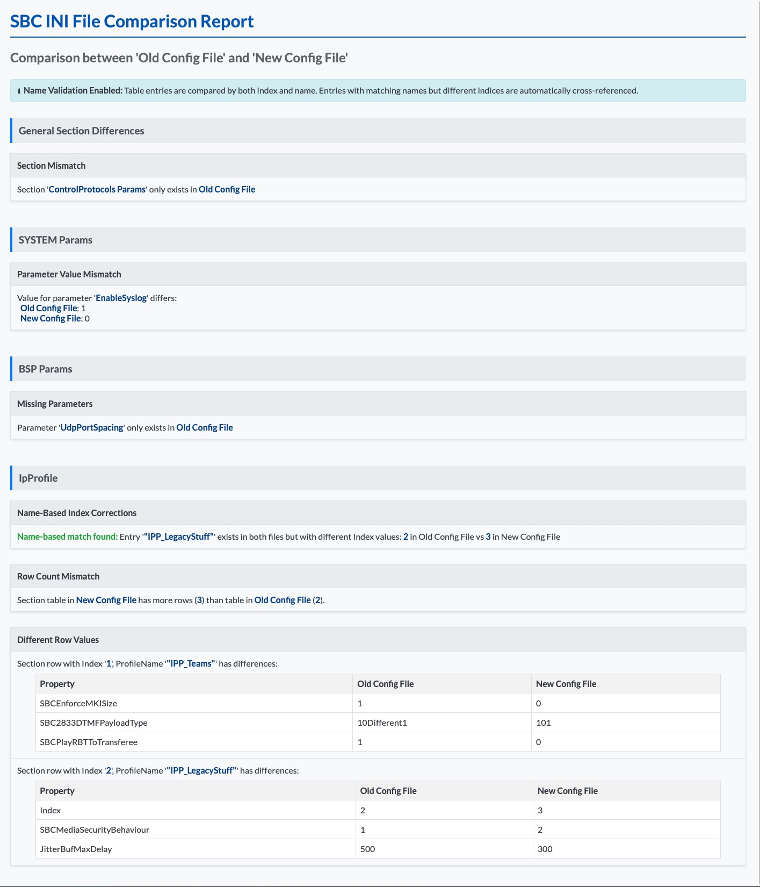

> **📢 Update - Aug 22, 2025:** This post has been updated with information about the new v2.0 release featuring enhanced name-based validation and improved reporting capabilities!

## The Challenge with AudioCodes SBC Configurations
If you’ve worked with AudioCodes Session Border Controllers (SBCs), you know that comparing INI configuration files can be tricky. These files are packed with sections like IP Profiles, where endless strings of 0s and 1s which will make spotting differences feel like searching for needles in a haystack. Manual reviews sometimes miss subtle changes in parameters that could lead to issues in call handling.
This is especially true when you have multiple SBCs in an "active-active-cluster" setup. The challenge is to quickly identify what’s changed, what’s missing, and what could potentially cause problems.

## PowerShell to the Rescue
I’ve developed a PowerShell script to simplify comparisons of AudioCodes SBC INI files. It parses the structured format, identifies variances in sections like IP-Profiles and generates a clean HTML report if there are differences.

🛠️ SBC-Focused compare:
* General settings
* Table based settings like IP Profiles
    * Drifted settings
    * Missing Rows

📋 HTML Report Features
* Customizable displayname for each SBC
* Clear section-by-section comparison
* Highlighted differences for easy spotting

## Sample Output
Here’s a screenshot of the HTML report generated by the script, showing differences between two SBC INI files (click to enlarge):

<a href="sample-report.jpg" target="_blank"></a>

## Getting Started with the Script
1. Clone or download from the repo.
2. Launch PowerShell and move to the script folder.
3. Compare with:

```powershell
.\Compare-ACSBCIniFiles.ps1  `
    -SBCIniFilePath1 "C:\Temp\SBC1.ini"  `
    -SBCName1 "Old Config File" `
    -SBCIniFilePath2 "C:\Temp\SBC2.ini" `
    -SBCName2 "New Config File" `
    -IncludeNameValidation $true `
    -ReportFilePath "C:\Temp\SBC-Comparison.html"
```

4. Open the generated HTML report in your browser.

**New Feature:** Use `-IncludeNameValidation $true` to enable intelligent name-based comparison that matches table entries by their names even when index positions differ!

## GitHub Repository
You can find the script in the GitHub repository: [AudioCodes SBC INI File Comparison](https://github.com/t-nebel/compare-ac-ini-files)

## Current Limitations ✅ **RESOLVED!**
~~One current limitation is (at least for now 😉) the handling of missmatching indexes but with the same content. For example, if both INI files have an IP Profile with the profile name "Teams" with the same settings, but on the first SBC it's listed as index 0 and on the second SBC as index 1, the script could not match them correctly and will show them as different.~~ 

**UPDATE Aug 22,2025:** This limitation has been completely resolved! The new `-IncludeNameValidation` parameter enables intelligent name-based comparison that automatically matches entries by their names, regardless of index position differences.

## 🎉 What's New in v2.0 (Aug 22,2025)

**Major Feature Enhancement: Name-Based Validation & Enhanced Reporting**

- **🔍 Smart Name-Based Matching:** New `-IncludeNameValidation` parameter automatically matches table entries by their names (e.g., IP Profile names) even when index positions differ
- **✅ Visual Success Indicators:** Console output now includes colored success indicators for matched entries with clear distinction between perfect matches and entries with differences  
- **🧠 Intelligent Comparison Logic:** Secondary name-based matching prevents false positives when identical content exists at different indices

The script now handles complex scenarios where entries exist in both files but at different positions - exactly what AudioCodes SBC admins have been asking for!