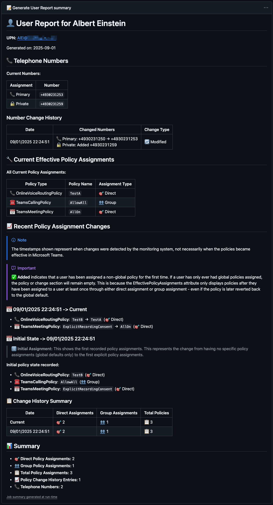
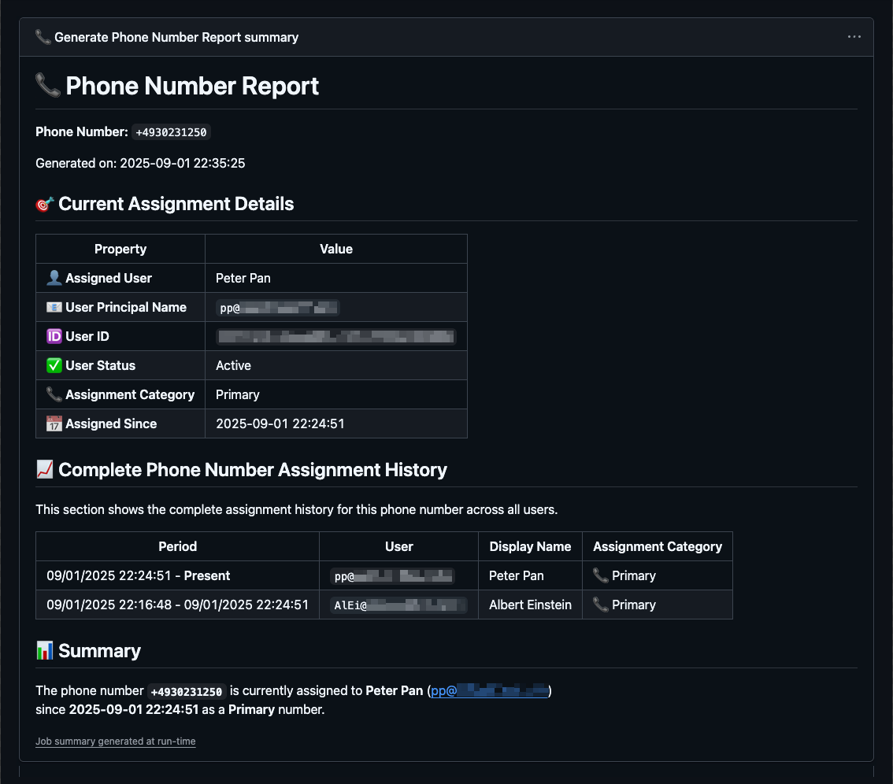

## The Mystery of the Missing Number

Ever played detective in your own Teams environment? One day, John Doe is reachable at his usual number, and the next, he’s vanished into the digital ether. You start asking the usual questions:

* 📞 What was John Doe's phone number before it was changed?
* 🔄 Did his Online Voice Routing Policy get switched?
* 🤔 And the million-dollar question: Who has his old number now?

These are the everyday mysteries that Teams admins face. It often feels like you need a digital DeLorean to go back in time and see what happened.

## Introducing: Teams User History

What if you had a personal Wayback Machine for your Teams users? That’s the idea behind the "Teams User History" project. It’s a simple, yet effective, way to keep track of user configurations over time.

The entire solution is built around a GitHub repository, which might sound a bit unusual at first. But when you think about it, it’s the perfect fit:

* 📝 **Automatic Versioning**: Every change is a commit. You get a complete, timestamped history of all data modifications for free.
* 🤝 **Simple Collaboration**: Need to share the data with a colleague? Just grant them access to the repo.
* ⚡ **Powerful Automation**: GitHub Actions are used to automatically collect the data on a schedule. No more manual exports!
* 🔐 **Secure Access**: By using a Federated Credential, the data collection script authenticates against Microsoft Graph API without any secrets stored in the repository.

## How it Works ⚙️

The project uses a PowerShell script, running on a scheduled GitHub Action, to fetch user details from your Microsoft tenant. It grabs key information like assigned phone numbers, Online Voice Routing Policies, and other user attributes, and stores them as JSON files in the repository.

Because every change to these files is a new commit in the git history, you can easily check the history to see when changes happened and what a user's configuration looked like at any point in time.

## Easy Reporting with GitHub Workflows 🚀

To make this even more user-friendly, the project includes two simple GitHub workflows that you can trigger manually from the UI:

1. 👤 **Get User History by UPN**: Just enter a User Principal Name (UPN), and the workflow will generate a report of that user's history.
2. 📞 **Get Number History**: Enter a phone number, and the workflow will tell you which users have had that number assigned to them over time.

It’s as simple as filling out a form and clicking a button.

### Running a Report

To run a report, follow these simple steps:

1.  Navigate to the **Actions** tab in your GitHub repository.
2.  Select the workflow you want to run from the list on the left.

#### 📝 Generate User Report

This workflow allows you to see the history of a specific user.

1.  Select the **📝 Generate User Report** workflow.
2.  Click the **Run workflow** dropdown button.
3.  Enter the **User Principal Name (UPN)** of the user you want to investigate.
4.  Click the green **Run workflow** button.

#### 📞 Generate Phone Number Report

This workflow helps you find out who has been assigned a specific phone number over time.

1.  Select the **📞 Generate Phone Number Report** workflow.
2.  Click the **Run workflow** dropdown button.
3.  Enter the **Phone Number** in E.164 format (e.g., `+1234567890`).
4.  Click the green **Run workflow** button.

This turns a potentially painful investigation into a two-minute task.

## Get Started 🎯

If you're tired of chasing ghosts in your Teams environment, head over to the GitHub repository to get started. The setup is straightforward, and the peace of mind is priceless. You can find the repository here: [Teams User History](https://github.com/t-nebel/teams-user-history)
